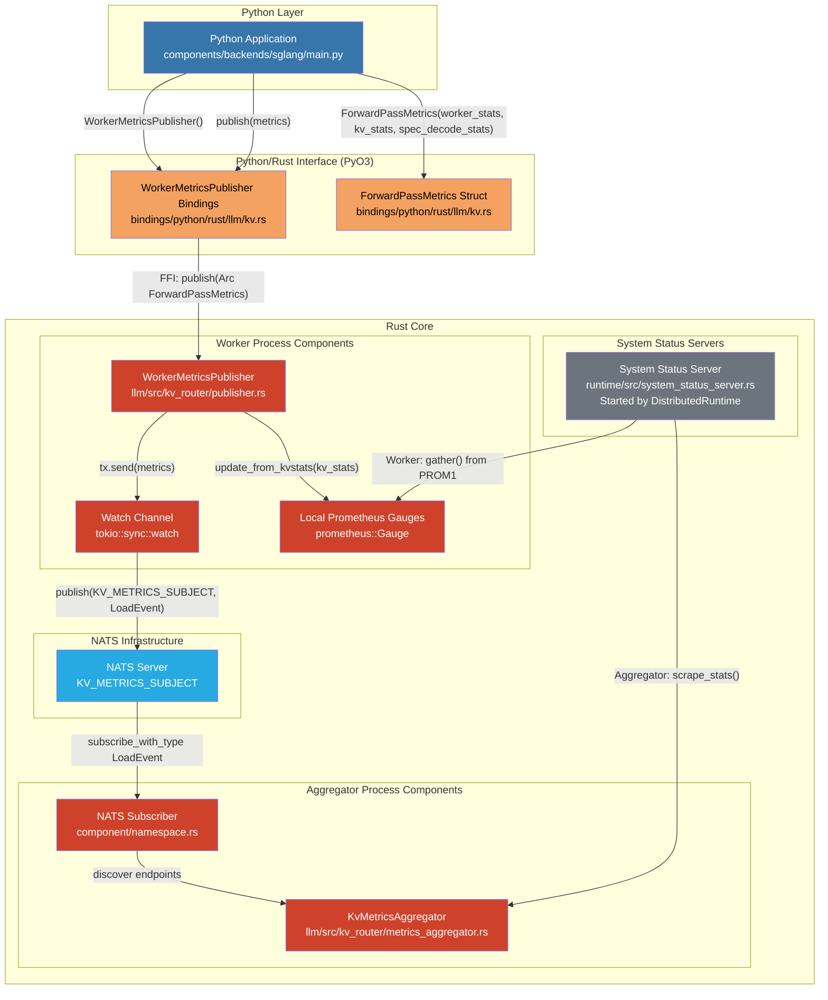
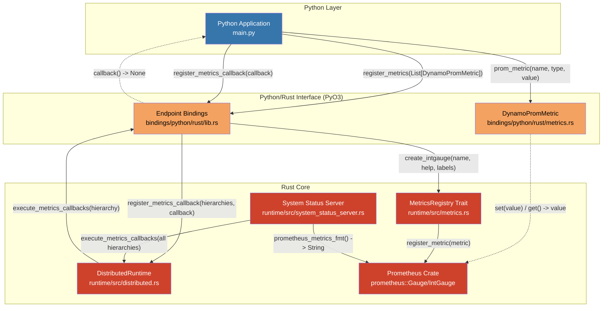
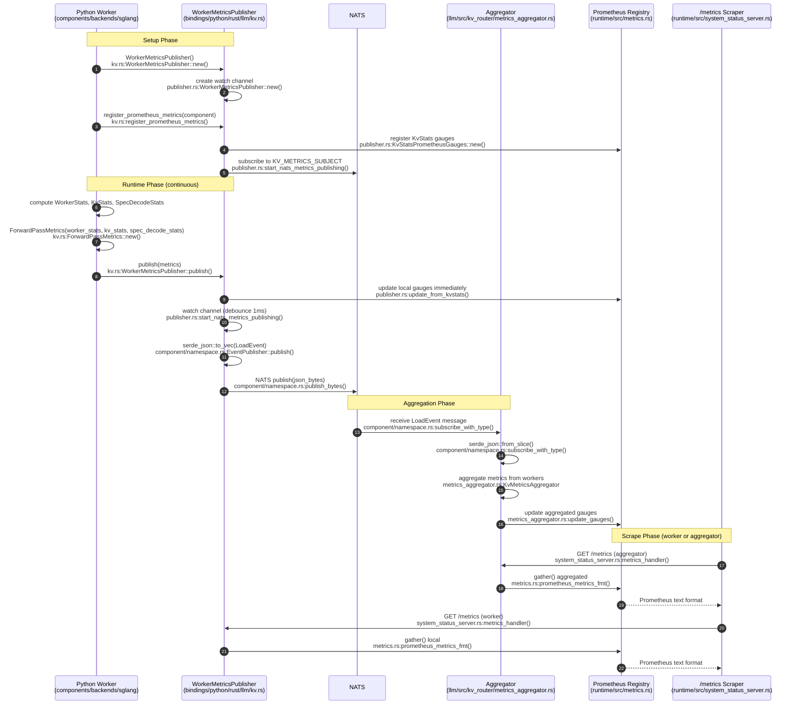
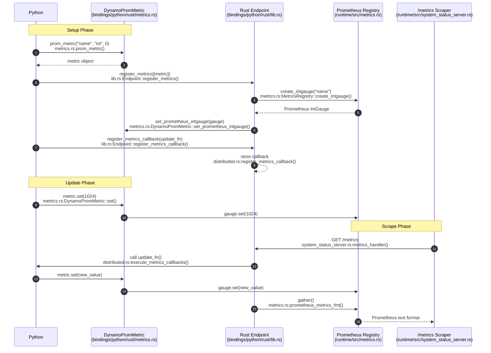

<!-- SPDX-FileCopyrightText: Copyright (c) 2025 NVIDIA CORPORATION & AFFILIATES. All rights reserved. -->
<!-- SPDX-License-Identifier: Apache-2.0 -->

# Python-Rust Metrics Integration

This directory demonstrates two methods for passing metrics between Python and Rust in the Dynamo runtime.

## Method 1: ForwardPassMetrics Pub/Sub via NATS with serde (Legacy method for passing metrics)

Python maintains its own metrics dictionary, serializes it, and publishes to NATS. Rust subscribes to NATS, deserializes the metrics, and updates Prometheus gauges.

**Example**: Used by `WorkerMetricsPublisher` in production code

```python
from dynamo.llm import WorkerMetricsPublisher, ForwardPassMetrics

# Create publisher
publisher = WorkerMetricsPublisher()
await publisher.create_endpoint(component, metrics_labels)

# Python maintains its own metrics dict
metrics_dict = {
    "num_running_reqs": 5,
    "num_waiting_reqs": 10,
    "gpu_cache_usage": 0.75,
}

# Serialize and publish to NATS
metrics = ForwardPassMetrics(metrics_dict)
publisher.publish(metrics)

# Rust subscribes to NATS, deserializes, and updates Prometheus
```

### Adding/Changing Metrics in Method 1

When you need to add or modify metrics in Method 1 (ForwardPassMetrics Pub/Sub via NATS with serde), you must update **multiple files**:

1. **`lib/llm/src/kv_router/protocols.rs`** - Add field to struct:
   ```rust
   pub struct WorkerStats {
       pub request_active_slots: u64,
       pub request_total_slots: u64,
       pub num_requests_waiting: u64,
       pub new_metric_field: u64,  // ADD THIS
   }
   ```

2. **`lib/llm/src/kv_router/publisher.rs`** - Manually create Prometheus gauge using DRT:
   ```rust
   fn new(component: &Component) -> Result<Self> {
       use dynamo_runtime::metrics::MetricsRegistry;

       // ... existing gauges ...

       // Manually create and register new Prometheus gauge
       let new_metric_gauge = component.create_gauge(
           "new_metric_name",
           "Description of new metric",
           &[],  // labels
       )?;

       // Store in struct
       Ok(KvStatsPrometheusGauges {
           kv_active_blocks_gauge,
           kv_total_blocks_gauge,
           gpu_cache_usage_gauge,
           gpu_prefix_cache_hit_rate_gauge,
           new_metric_gauge,  // ADD THIS
       })
   }
   ```

3. **`lib/llm/src/kv_router/publisher.rs`** - Update gauge in `update_from_kvstats()`:
   ```rust
   fn update_from_kvstats(&self, kv_stats: &KvStats) {
       // ... existing updates ...
       self.new_metric_gauge.set(worker_stats.new_metric_field as f64);
   }
   ```

4. **`components/backends/sglang/.../publisher.py`** - Update Python code to compute new metric:
   ```python
   def collect_metrics():
       worker_stats = WorkerStats(
           request_active_slots=...,
           new_metric_field=compute_new_metric(),  # ADD THIS
       )
   ```

**Result**: Changes require touching 3-4 files across Rust and Python codebases.

## Method 2: Declarative/Registration-based (New method for passing metrics)

Python creates metric objects using `prom_metric()`, registers them with an endpoint, and updates values through these objects. Rust creates the underlying Prometheus gauges and calls Python callbacks before scraping.

**Example**: `server.py`

```python
# Create metric objects
request_slots = prom_metric("request_total_slots", "int", 2048)
gpu_usage = prom_metric("gpu_cache_usage_percent", "float", 0.0)

# Register with endpoint
endpoint.register_metrics([request_slots, gpu_usage])

# Register callback for dynamic updates
def update_metrics():
    request_slots.set(compute_slots())
    gpu_usage.set(compute_gpu_usage())

endpoint.register_metrics_callback(update_metrics)
```

### Adding/Changing Metrics in Method 2

When you need to add or modify metrics in Method 2 (Declarative), you only update **Python code**:

1. **Create new metric** - Just add one line in Python:
   ```python
   new_metric = prom_metric("new_metric_name", "int", 0)
   ```

2. **Register it** - Add to the list:
   ```python
   endpoint.register_metrics([request_slots, gpu_usage, new_metric])
   ```

3. **Update in callback** - Add update logic:
   ```python
   def update_metrics():
       request_slots.set(compute_slots())
       gpu_usage.set(compute_gpu_usage())
       new_metric.set(compute_new_metric())  # ADD THIS
   ```

**Result**: Changes only require modifying Python code. No Rust changes needed. The Prometheus gauge is automatically created and registered by the Rust runtime.

## Architecture Diagrams

### Component Architecture

#### Method 1: ForwardPassMetrics Pub/Sub via NATS with serde - Component View



#### Method 2: Declarative/Registration-based - Component View



### Sequence Diagrams

#### Method 1: ForwardPassMetrics Pub/Sub via NATS with serde



#### Method 2: Declarative/Registration-based



## Comparison

| Aspect | Method 1: ForwardPassMetrics Pub/Sub | Method 2: Declarative |
|--------|----------------------|------------------------|
| **Ownership** | Python owns metrics dict, Rust owns Prometheus objects | Python holds metric objects, Rust holds Prometheus objects |
| **Communication** | Indirect via NATS message broker | Direct Foreign Function Interface (callbacks from Rust to Python) |
| **Update Pattern** | Serialize entire dict and publish | `.set()` on individual metric objects |
| **Serialization** | JSON/MessagePack serialization to NATS | No serialization (direct FFI calls) |
| **Overhead** | Medium (NATS network + serialization) | Higher (Python-Rust FFI per metric update) |
| **Decoupling** | Loosely coupled (can run in different processes) | Tightly coupled (Python and Rust in same process) |
| **Scalability** | Multiple workers publish to same topic | Single worker only |
| **Flexibility** | Push-based, may have stale values | Callback ensures fresh values before scrape |
| **Complexity** | High (NATS setup, struct changes, Rust+Python) | Low (Python-only, simple API) |
| **Use Case** | Distributed workers publishing to aggregator | Single-process services with dynamic updates |
